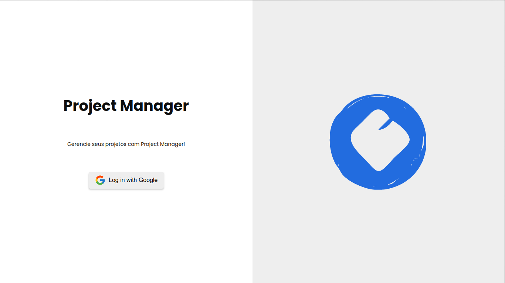
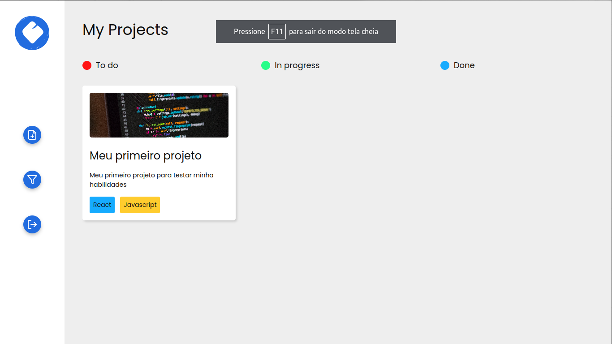
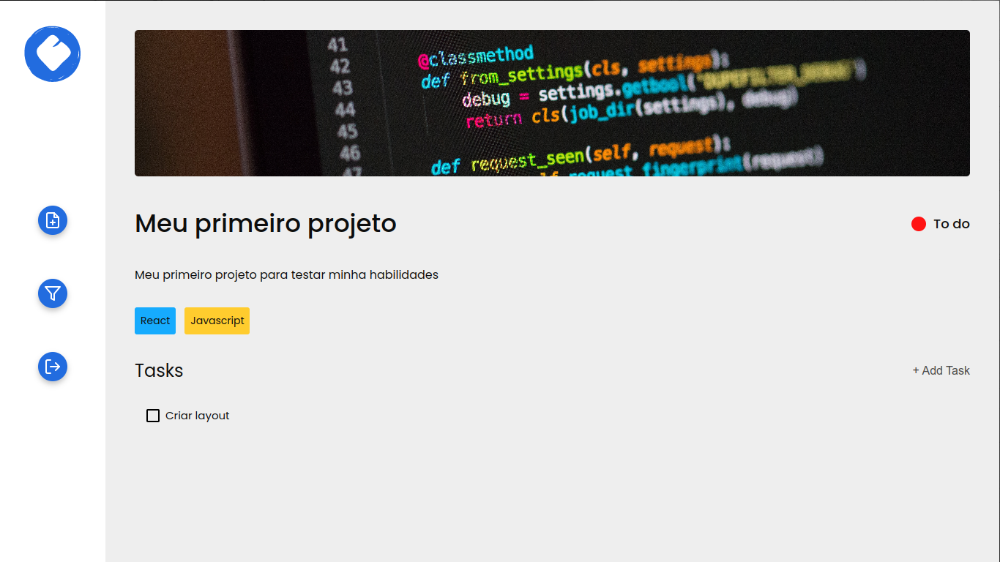

# 📊 Project Manager


> Projeto no modelo Kanban para te ajudar a gerenciar melhor seus projetos.

## 🖥️ Layouts





## 🛠️ Techs

<div>
  
  
  
  
  
</div>

## 🛸 Instalação e Execução do projeto

Basta fazer um clone do repositório usando o git:

```bash
git clone https://github.com/LucasAndrade912/project-manager.git
```

Depois de clonar o projeto instale suas dependências com o comando:

```bash
npm install

# or

yarn install
```

E finalmente rode o comando `npm run dev` ou `yarn dev` e abre o projeto no seu navegador.
